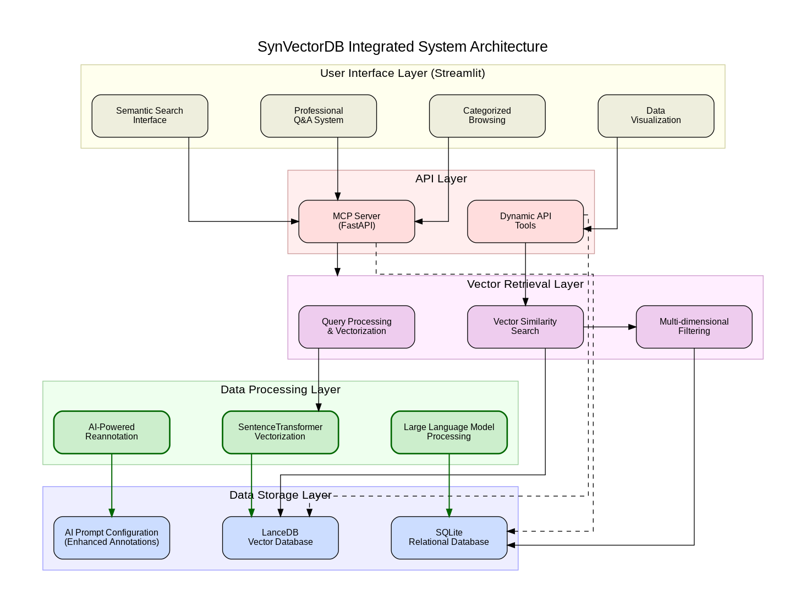

# SynVectorDB: Embedding-Based Retrieval System for Synthetic Biology Parts

A comprehensive synthetic biology parts database with embedding-based semantic search capabilities, providing an intuitive interface for researchers to find, explore, and utilize biological parts.

## Features

- 🔍 **Semantic Search**: Natural language-based intelligent search using sentence transformers
- 🔎 **Parts Browser**: Browse and filter parts by type, source, and other attributes
- 💬 **Question & Answer**: AI-powered assistant for synthetic biology inquiries
- 📊 **Data Visualization**: Interactive database statistics and visualizations
- 🔌 **MCP Server API**: Standardized data access interface for programmatic use
- 🧬 **Multi-level Classification**: Hierarchical part classification system

## System Architecture



SynVectorDB is built on a multi-layered architecture designed for efficient retrieval and analysis of synthetic biology parts. The system integrates:

- **User Interface Layer**: Powered by Streamlit, providing intuitive access to all features
- **API Layer**: Bridge between frontend and backend services using FastAPI
- **Core Services Layer**: Implements semantic search using sentence transformers
- **Data Storage Layer**: Combines LanceDB for vector embeddings and SQLite for structured data

## Quick Start

### Prerequisites

- [Mamba](https://mamba.readthedocs.io/en/latest/installation.html) or [Conda](https://docs.conda.io/en/latest/miniconda.html)
- Python 3.10+ (installed via environment.yml)

### Installation

```bash
# Clone repository
git clone https://github.com/AilurusBio/synbio-parts-db.git
cd synbio-parts-db

# Create and activate environment using mamba
mamba env create -f environment.yml
mamba activate SynVectorDB

# Configure environment
cp .env.example .env
# Edit .env with your configuration
```

> Note: You can also use conda instead of mamba with the same commands, but mamba is significantly faster.

### Running the Application

```bash
# Start the application
./start_server.sh start

# Access the application at http://localhost:8501

# To stop the application
./start_server.sh stop
```

## API Documentation

Access API documentation at: `http://localhost:8000/docs`

## Project Structure

```
synbio-parts-db/
├── streamlit_version/     # Run application
├── papermd/              # Documentation and papers
├── examples/             # Example code
└── requirements.txt      # Project dependencies
```

## Database Schema

The project uses SQLite for structured data storage with the following main tables:
- `parts`: Stores all biological parts information
- `embeddings`: Stores vector embeddings for semantic search

### Part Structure

Parts in the database include the following key information:
- **Name**: Descriptive name of the part
- **Type**: Hierarchical classification (up to 3 levels)
- **Sequence**: DNA/protein sequence data
- **Source**: Origin database or collection
- **Description**: Functional description and notes
- **References**: Related publications and sources

## Usage

### Web Interface

The web interface provides several pages:

1. **Home**: Overview and statistics of the database
2. **Semantic Search**: Search parts using natural language queries
3. **Parts Browser**: Browse and filter parts by various attributes
4. **Question & Answer**: AI assistant for synthetic biology inquiries
5. **MCP Server**: API documentation and interface

### API Usage

The API provides endpoints for searching parts, retrieving part details, and more:

Key Endpoints:
- `GET /tools` - List available tools
- `POST /tools/semantic_search` - Perform semantic search
- `GET /parts/{part_id}` - Get part details
- `POST /parts/search` - Search parts with multiple parameters
- `GET /stats` - Get database statistics

## Server Management

The project includes a server management script for easy control:

```bash
# Start services
./start_server.sh start

# Check service status
./start_server.sh status

# View logs
./start_server.sh logs streamlit
./start_server.sh logs api

# Stop services
./start_server.sh stop

# Restart services
./start_server.sh restart
```

## Data Storage

The project uses:
- **SQLite**: For structured data storage (parts.db)
- **LanceDB**: For vector embeddings storage (parts.lance)

## Contributing

We welcome contributions! Please feel free to submit issues and pull requests.

## Contact

📧 **Contact Us**: jiesong@whu.edu.cn

📥 **Complete Data Download**: [Database](https://github.com/AilurusBio/synbio-parts-db/blob/main/streamlit_version/data/parts.db)

🔗 **Project Repository**: [GitHub](https://github.com/AilurusBio/synbio-parts-db/)

## License

This project is licensed under the MIT License - see the LICENSE file for details.
