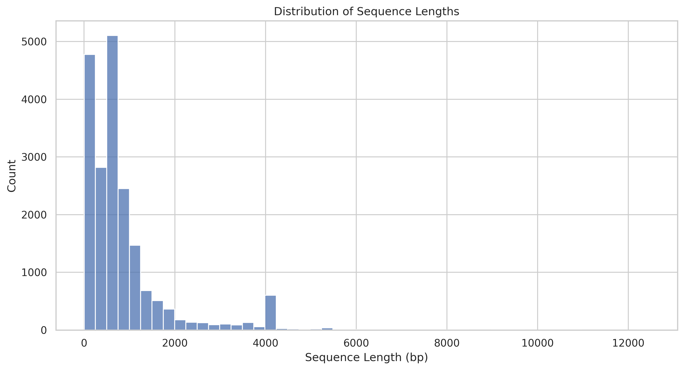
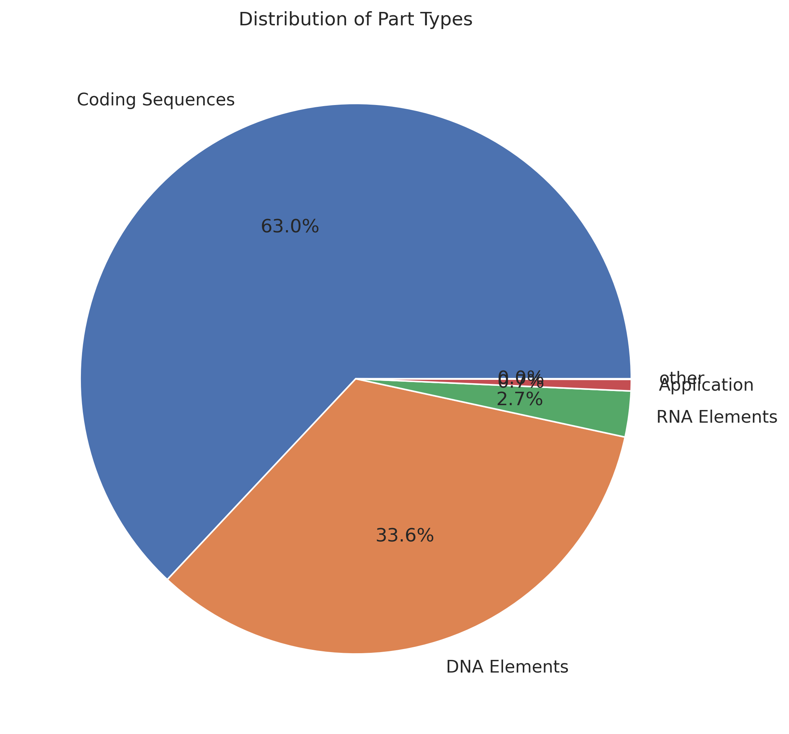
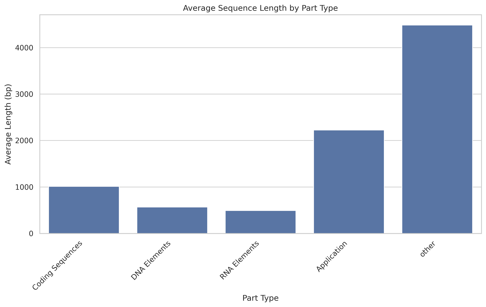
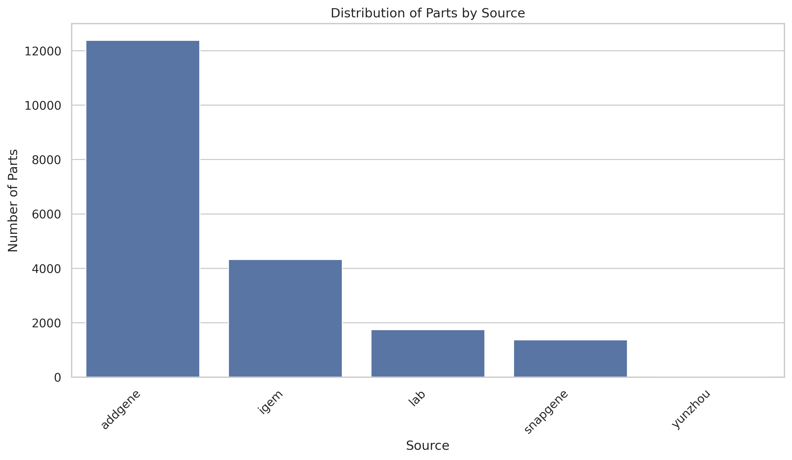
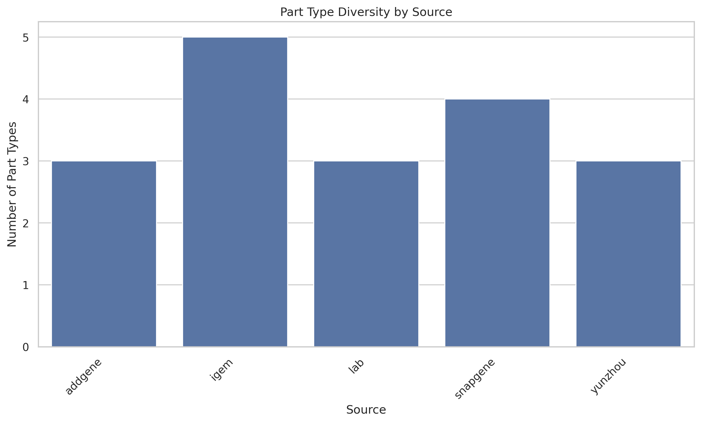

# Database Statistics Report
Generated on: 2025-03-16 19:23:52

## Overview
- **Total Parts**: 19850
- **Functional Categories**: 5
- **Subtypes**: 14
- **Data Sources**: 5

## Sequence Statistics
- **Total Sequences**: 19850
- **Minimum Length**: 1 bp
- **Maximum Length**: 12461 bp
- **Average Length**: 858.27 bp

## Type Distribution
The database contains the following part types:

| Type | Count | Average Length (bp) | Min Length (bp) | Max Length (bp) |
|------|-------|-------------------|----------------|----------------|
| Coding Sequences | 12509 | 1011.93 | 4 | 12461 |
| DNA Elements | 6666 | 568.08 | 1 | 9594 |
| RNA Elements | 534 | 490.78 | 15 | 7064 |
| Application | 134 | 2224.61 | 35 | 9476 |
| other | 7 | 4485.86 | 12 | 7985 |

## Source Distribution
Distribution of parts across different sources:

| Source | Part Count | Type Count | Average Length (bp) |
|--------|------------|------------|-------------------|
| addgene | 12383 | 3 | 806.63 |
| igem | 4322 | 5 | 1081.54 |
| lab | 1744 | 3 | 804.13 |
| snapgene | 1367 | 4 | 694.84 |
| yunzhou | 34 | 3 | 629.50 |

## Category Details
Main functional categories in the database:
**Coding Sequences**, **DNA Elements**, **RNA Elements**, **Application**, **other**

## Subtype Details
Available subtypes in the database:
**Membrane_proteins**, **Reporter**, **Structural**, **Enzyme**, **Regulatory**, **Regulatory_RNA**, **Regulatory_proteins**, **Binding**, **Guide_RNA**, **Structural_RNA**, **Biocontrol**, **Biosafety**, **Biosynthesis**, **other**

## Data Sources
Data is collected from the following sources:
**igem**, **addgene**, **lab**, **snapgene**, **yunzhou**
